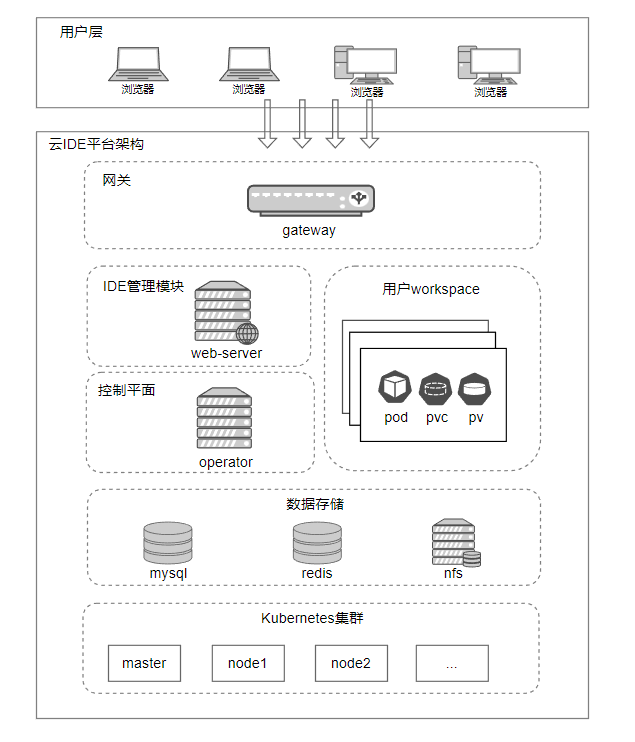
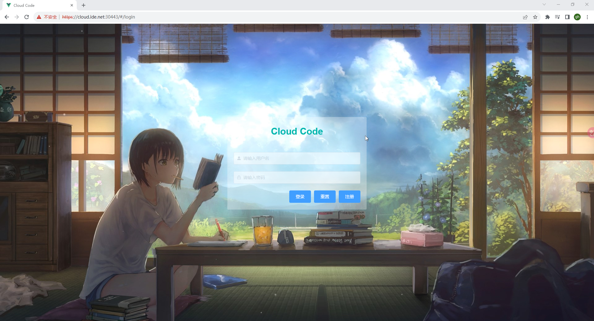
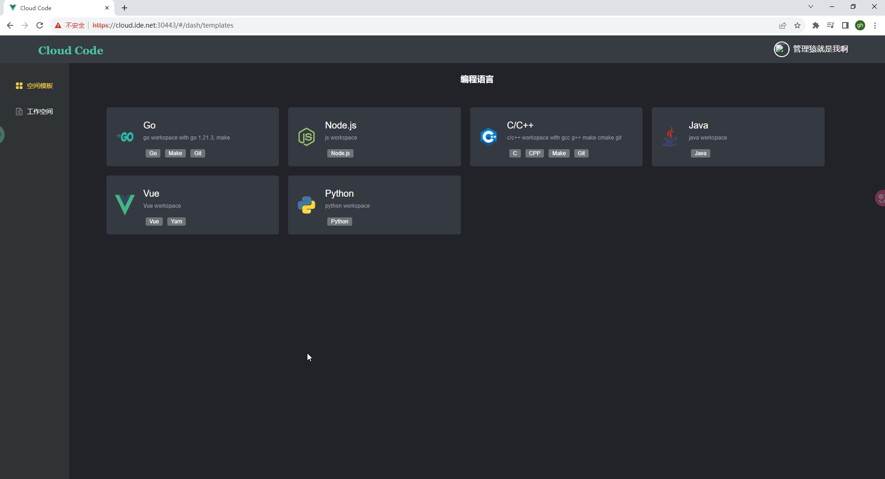
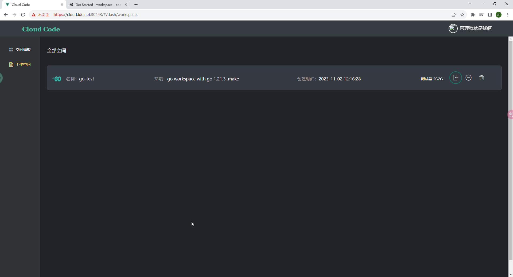
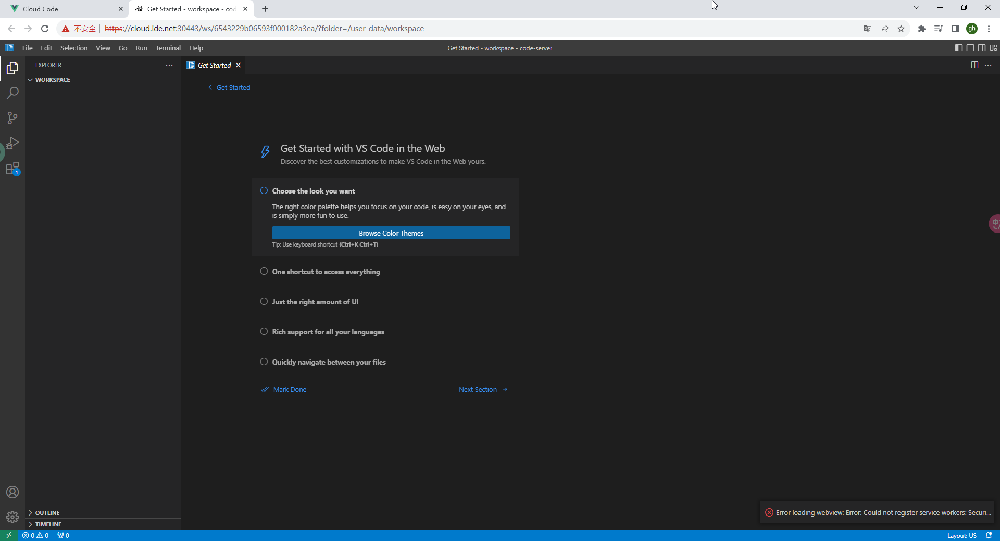

# 🌐 Cloud IDE - 云端智能开发环境

Cloud IDE 是一个基于 Kubernetes 和 VS Code Server 构建的多用户云端集成开发环境管理系统。它让您能够通过浏览器创建和访问云端 VS Code 实例，并集成了强大的 AI 编程助手能力。

## ✨ 核心特性

### 🚀 云端开发环境
- **多用户支持**: 提供隔离的多用户开发环境，每个用户拥有独立的工作空间
- **浏览器访问**: 通过浏览器即可访问完整的 IDE，无需本地安装任何软件
- **VS Code 集成**: 基于强大的 VS Code，提供丰富的代码编辑、调试和扩展功能
- **云端托管**: IDE 实例托管在云端，确保可扩展性、可用性和灵活性
- **工作空间管理**: 提供完善的工作空间管理功能，轻松创建和管理项目

### 🤖 AI 智能编程助手
- **Claude AI 集成**: 集成 [claude-code-router](https://github.com/musistudio/claude-code-router)，提供强大的 AI 编程辅助
- **多 AI 提供商支持**: 
  - 🧠 Anthropic Claude (3.5 Sonnet, 3 Opus, 3 Haiku)
  - 🚀 OpenAI GPT (GPT-4, GPT-4 Turbo, GPT-3.5 Turbo)
  - 🔍 DeepSeek (DeepSeek Chat, DeepSeek Coder)
  - 💎 Google Gemini (Gemini 2.5 Pro, Gemini Pro)
  - 🌙 月之暗面 Kimi (Moonshot v1 系列)
  - 🔥 阿里通义千问 (Qwen Turbo/Plus/Max)
- **智能路由系统**: 根据任务类型自动选择最适合的模型，优化成本和性能
- **代码补全**: VS Code 智能代码补全，支持多种编程语言

### 📱 移动端开发支持
- **响应式设计**: 完全适配移动端设备，支持手机和平板开发
- **触摸优化**: 针对触摸屏设备优化的交互体验
- **移动端友好**: 登录、工作空间管理、代码编辑等全流程移动端适配
- **跨设备同步**: 工作空间在不同设备间无缝切换

### 🏗️ 容器化架构
- **Kubernetes 原生**: 基于 Kubernetes 的容器编排，支持自动扩缩容
- **多语言模板**: 预置 Python、Node.js、Go、Java、C++ 等开发环境模板
- **持久化存储**: 支持 NFS 持久化存储，确保代码和数据安全
- **一键部署**: 简化的部署流程，快速搭建开发环境


## 🎯 主要用途

### 💻 在线开发
- **即开即用**: 通过浏览器直接访问完整的开发环境，无需配置
- **多语言支持**: Python、JavaScript、Go、Java、C++ 等主流编程语言
- **实时协作**: 支持多人同时在线开发，实时同步代码变更
- **云端存储**: 代码自动保存到云端，永不丢失

### 🤖 AI 辅助编程
- **智能代码生成**: 通过 Claude 等 AI 模型生成高质量代码
- **代码优化建议**: AI 分析代码并提供优化建议
- **错误诊断**: 智能识别和修复代码问题
- **文档生成**: 自动生成代码注释和技术文档

### 📱 移动端开发
- **移动优先**: 完全适配手机和平板设备的开发体验
- **触控友好**: 优化的触摸交互，支持手势操作
- **响应式界面**: 自适应不同屏幕尺寸的设备
- **离线同步**: 支持离线编辑和在线同步

### 🏢 团队协作
- **用户隔离**: 每个开发者拥有独立的工作空间
- **权限管理**: 细粒度的用户权限控制
- **项目模板**: 预置的项目模板，快速启动新项目
- **版本控制**: 集成 Git，支持版本管理和协作开发

## 🛠️ 技术架构

| 技术栈 | 描述 |
|--------|------|
| **前端技术** |  |
| Vue.js | 现代化的前端框架，构建响应式用户界面 |
| Element UI | 丰富的组件库，已完全移动端适配 |
| CSS3 Grid/Flexbox | 现代布局技术，实现响应式设计 |
| **后端技术** |  |
| Go | 高性能的后端开发语言 |
| Gin | 轻量级 Web 框架，构建 RESTful API |
| gRPC | 高性能 RPC 框架，微服务通信 |
| **容器化技术** |  |
| Kubernetes | 容器编排平台，管理和扩展云应用 |
| Docker | 容器化平台，构建标准化的应用镜像 |
| Code-Server | 浏览器版 VS Code，提供完整 IDE 体验 |
| **AI 集成** |  |
| claude-code-router | 开源 AI 路由工具，统一多个 AI 提供商 |
| Anthropic Claude | 强大的 AI 编程助手 |
| 多 AI 提供商 | OpenAI、DeepSeek、Gemini 等多种选择 |
| **基础设施** |  |
| OpenResty + Lua | 服务发现和反向代理 |
| Kubebuilder | Kubernetes API 和控制器框架 |
| MySQL | 关系型数据库，存储用户和项目数据 |
| NFS + CSI Driver | 持久化存储，自动卷分配 |

## 🏗️ 系统架构


### 架构组件说明
- **前端界面**: Vue.js + Element UI 构建的响应式用户界面
- **API 网关**: 统一的入口点，处理认证和路由
- **Web 服务**: Go + Gin 实现的业务逻辑处理
- **控制平面**: Kubernetes 控制器，管理工作空间生命周期
- **工作空间**: Code-Server 容器实例，提供开发环境
- **存储层**: NFS 持久化存储 + MySQL 数据库

## 📱 界面展示

### 🔐 登录界面

*支持多种登录方式，完全移动端适配*

### 📋 模板选择

*丰富的开发环境模板，包括 Claude AI 助手环境*

### 🗂️ 工作空间管理

*直观的工作空间管理界面，支持创建、删除、监控*

### 💻 开发环境

*完整的 VS Code 开发环境，集成 AI 编程助手*

## 🚀 快速开始

### 1. 创建工作空间
```bash
# 选择模板类型
- Python 开发环境
- Node.js 开发环境  
- Go 开发环境
- Claude AI 助手环境 (推荐)
```

### 2. 配置 AI 助手 (可选)
```bash
# Claude AI 配置
ANTHROPIC_API_KEY=your_claude_api_key
OPENAI_API_KEY=your_openai_api_key
DEEPSEEK_API_KEY=your_deepseek_api_key
```

### 3. 使用 AI 编程助手
```bash
# 在工作空间终端中使用
claude "写一个 Python 快速排序算法"
claude "解释这段代码的功能" --file app.py
claude "优化这个函数的性能" --file utils.py
```

## 📱 移动端使用指南

### 支持的设备
- 📱 **智能手机**: iOS Safari 12+, Android Chrome 80+
- 📟 **平板电脑**: iPad, Android 平板
- 💻 **桌面设备**: 现代浏览器全支持

### 移动端特性
- **响应式布局**: 自适应不同屏幕尺寸
- **触摸优化**: 44px+ 触摸目标，手势友好
- **离线支持**: 基础编辑功能支持离线使用
- **快速切换**: 设备间无缝切换工作空间

## Deployment

see [Deployment Guide](deploy/README.md).


## License

Copyright 2023.

Licensed under the Apache License, Version 2.0 (the "License");
you may not use this file except in compliance with the License.
You may obtain a copy of the License at

    http://www.apache.org/licenses/LICENSE-2.0

Unless required by applicable law or agreed to in writing, software
distributed under the License is distributed on an "AS IS" BASIS,
WITHOUT WARRANTIES OR CONDITIONS OF ANY KIND, either express or implied.
See the License for the specific language governing permissions and
limitations under the License.
